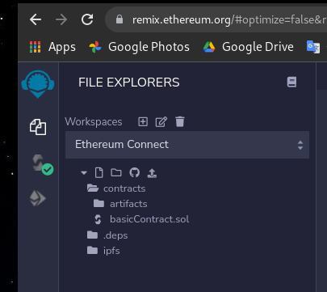
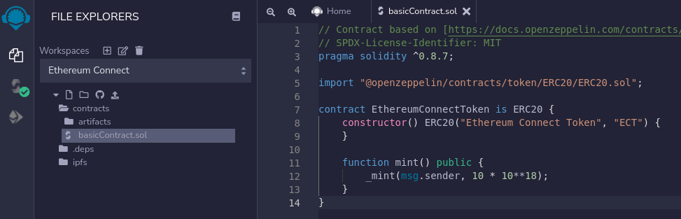
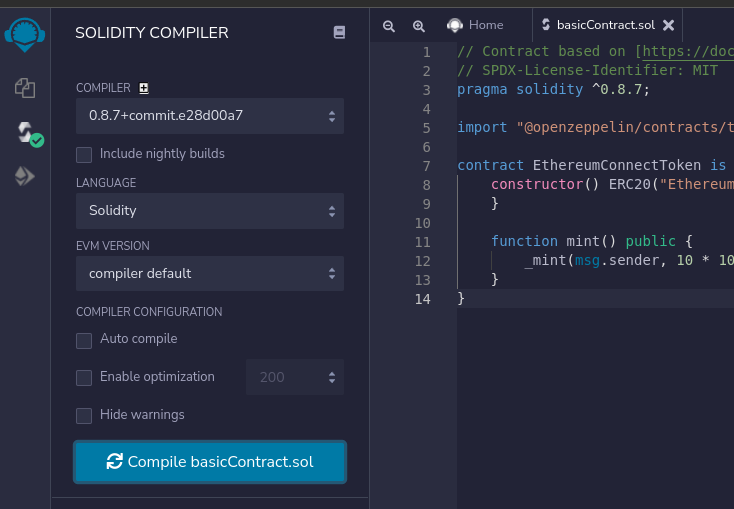
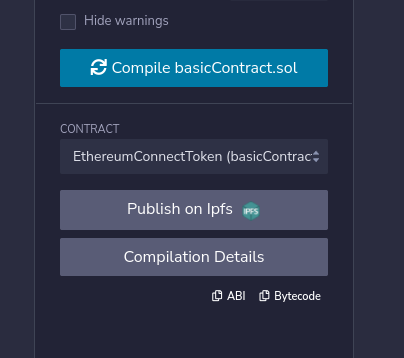
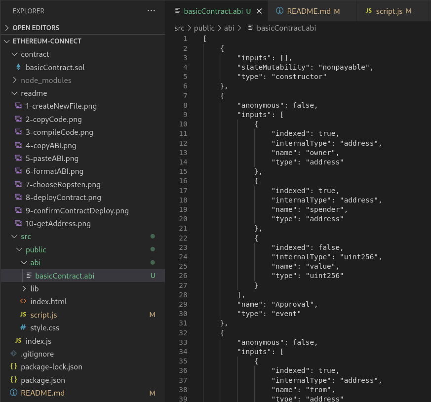
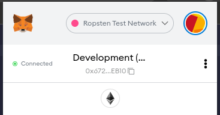
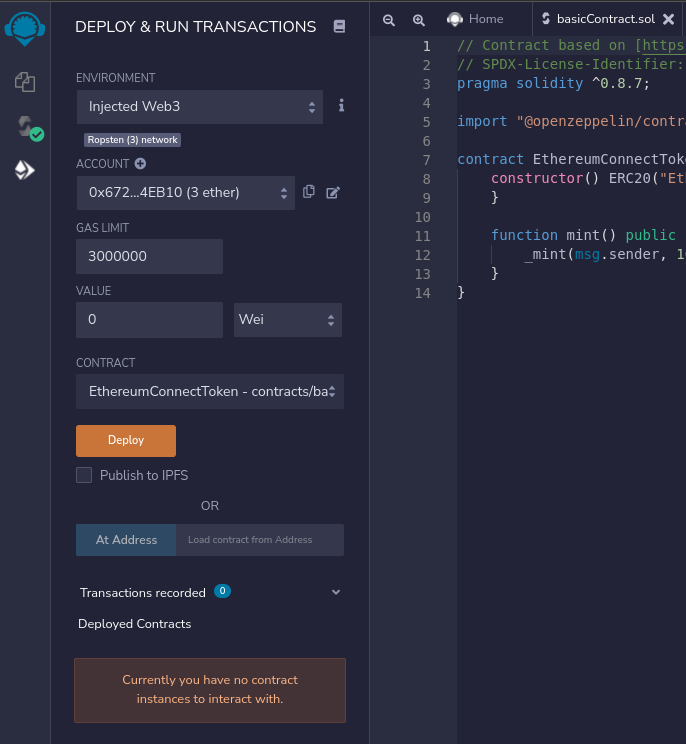
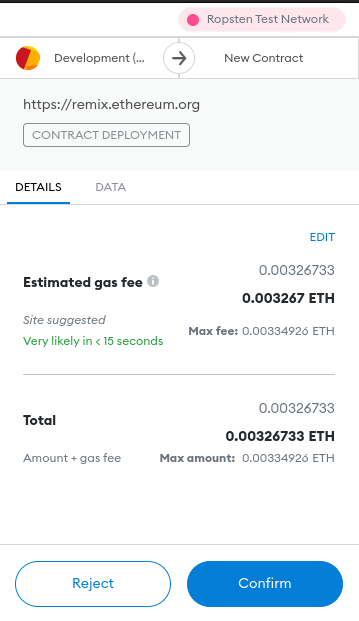
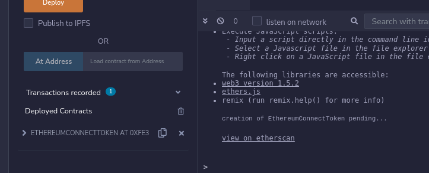

# Ethereum Connect

Welcome to ethereum-connect, a tiny front-end project which demonstrates how to perform various functions on the Ethereum network via Metamask.

I've tried to keep this project as simple as possible, I'm not using any front-end frameworks like React.js and everything is written in plain Javascript.

## Getting Started

1. Clone this repository.
2. Run `npm install`.
3. Run `npm start`.
4. Navigate to `localhost:3000` to view the demo.

## Chapters

I've broken up the project into chapters and tagged each one as follows:

- **[1.0.0]** Connect to Metamask and get address of user.
- **[2.0.0]** Deploying contracts and running contract functions.

## Deploying Contracts

This is a super quick tutorial on how to deploy a contract, get the ABI and format it so that it can be used with the Ethers library.

1. Go to https://remix.ethereum.org/
2. In Remix create a new file, name it `basicContract.sol`  

3. Copy the contents of `contract/basicContract.sol` into the file you created in (2).  

4. Click on the compile tab, then "Compile basicContract.sol" button.  

5. You can get the ABI by selecting "EthereumConnectToken (basicContract.sol)" from the "Contract" dropdown list then pressing the copy ABI button.  

6. Create a new file under the `src/public/abi` folder and paste the ABI in there (or just overwrite `src/public/abi/basicContract.abi`, it should be the same anyway).  

7. Ensure that you have the "Ropsten Test Network" selected in Metamask.  

8. If you don't have any ETH, grab some from a faucet ([faucet 1](https://faucet.egorfine.com/), [faucet 2](https://faucet.dimensions.network/)).  
9. Ensure that the environment has been set to "Injected Web3" and deploy your contract.  

10. Confirm the deployment of your contract.  

11. Once the transaction has been confirmed, you can get the contract address by using the copy address button under "Deployed Contracts".  

12. You should now have a formated ABI and contract address which you can use to create an Ether's contract: `const contract = new ethers.Contract(basicContract.address, abi, signer);`